# Architecture Blueprint

Ten Mermaid diagrams providing a visual reference for the architect system.

---

## 1. System Context

Top-level view of actors, systems, and their relationships.

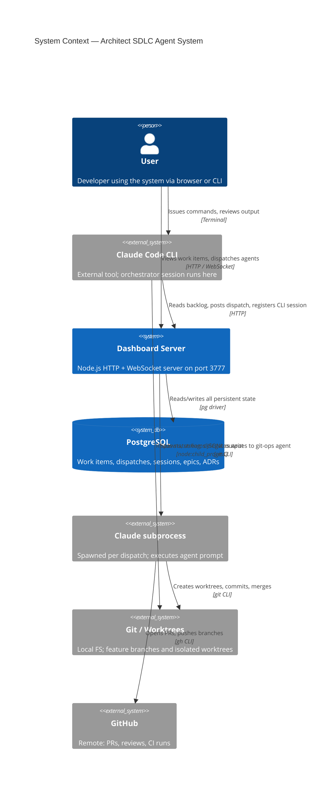

---

## 2. Container Diagram

What runs where and how containers relate.

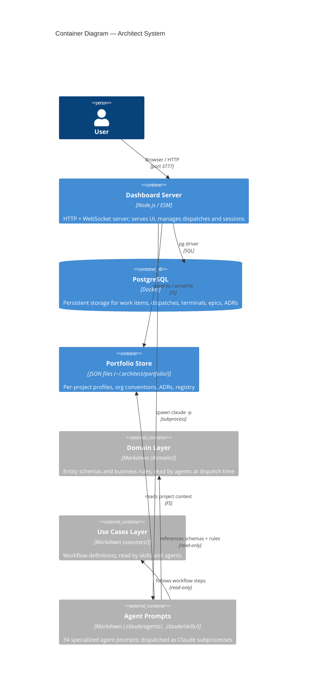

---

## 3. Component Diagram (Dashboard Container)

Internal structure of `tools/dashboard/`.

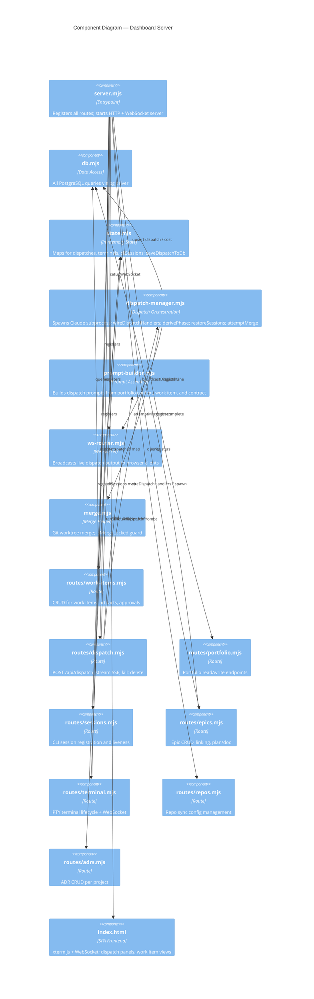

---

## 4. Data Flow — Dispatch Lifecycle

Sequence from POST /api/dispatch to session archive.

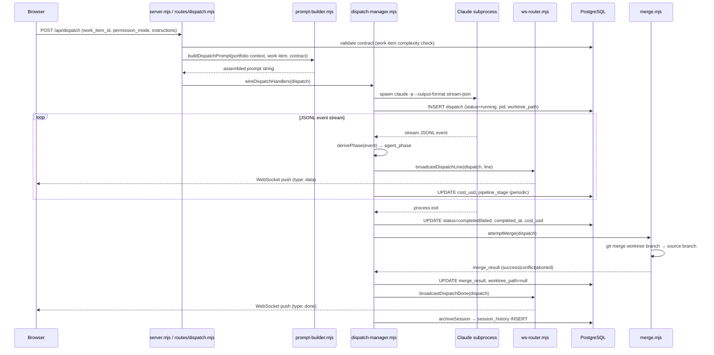

---

## 5. ER Diagrams

Key PostgreSQL tables and their relationships. Split into three focused sub-sections for readability. Schema derived from migration files 001–023.

### 5a. Core Work Entities

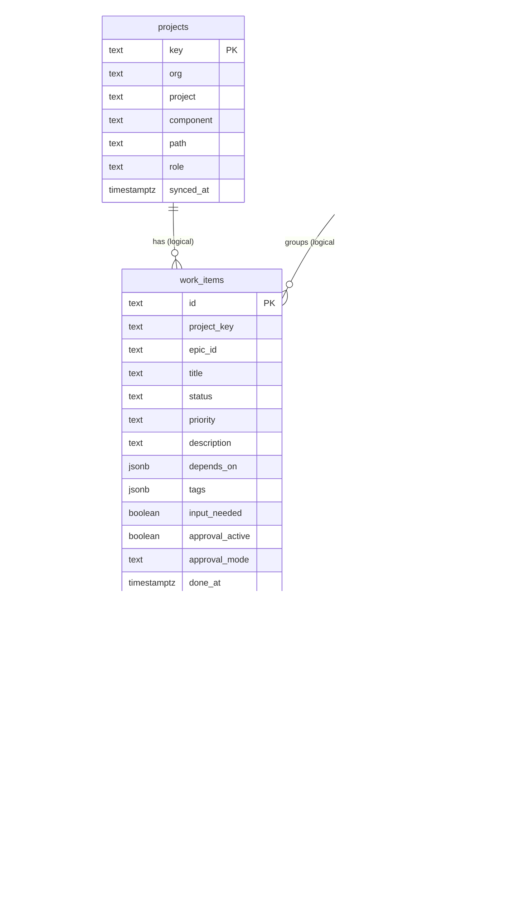

### 5b. Session Entities

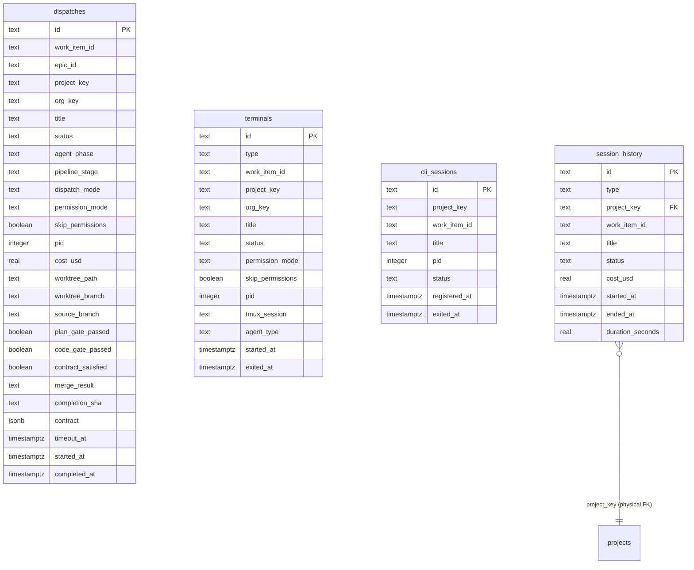

### 5c. Knowledge and Sync Entities

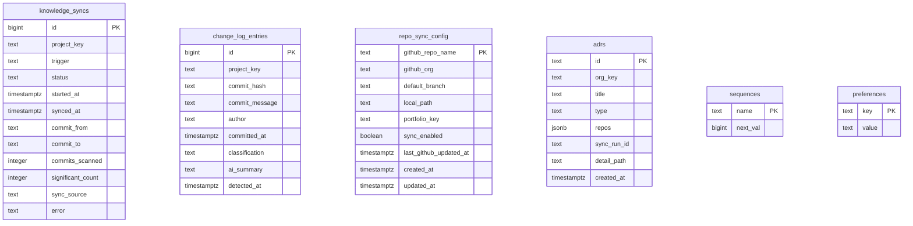

---

## 6. Skills to Agents

Primary dispatch relationships from skills to the agents they invoke.

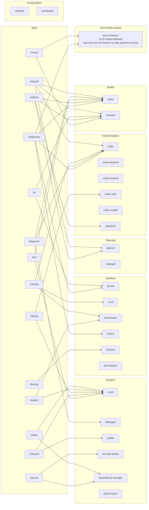

---

## 7. Dispatch State Machines

### 7a. Dispatch Session Lifecycle

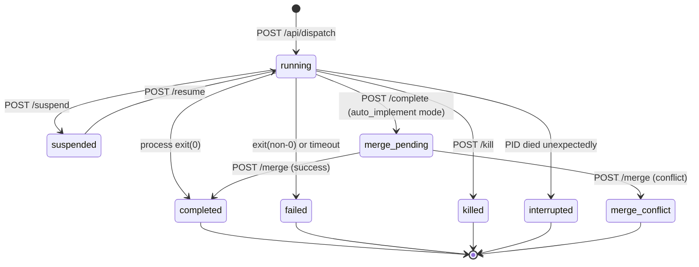

### 7b. Agent Phase

`agent_phase` is non-null only when `dispatch.status = 'running'`. Terminal dispatch statuses imply `agent_phase = null`. Persisted to `dispatches.agent_phase` column since W-987 (migration 019). Transitions derived from `derivePhase()` in `dispatch-manager.mjs`.

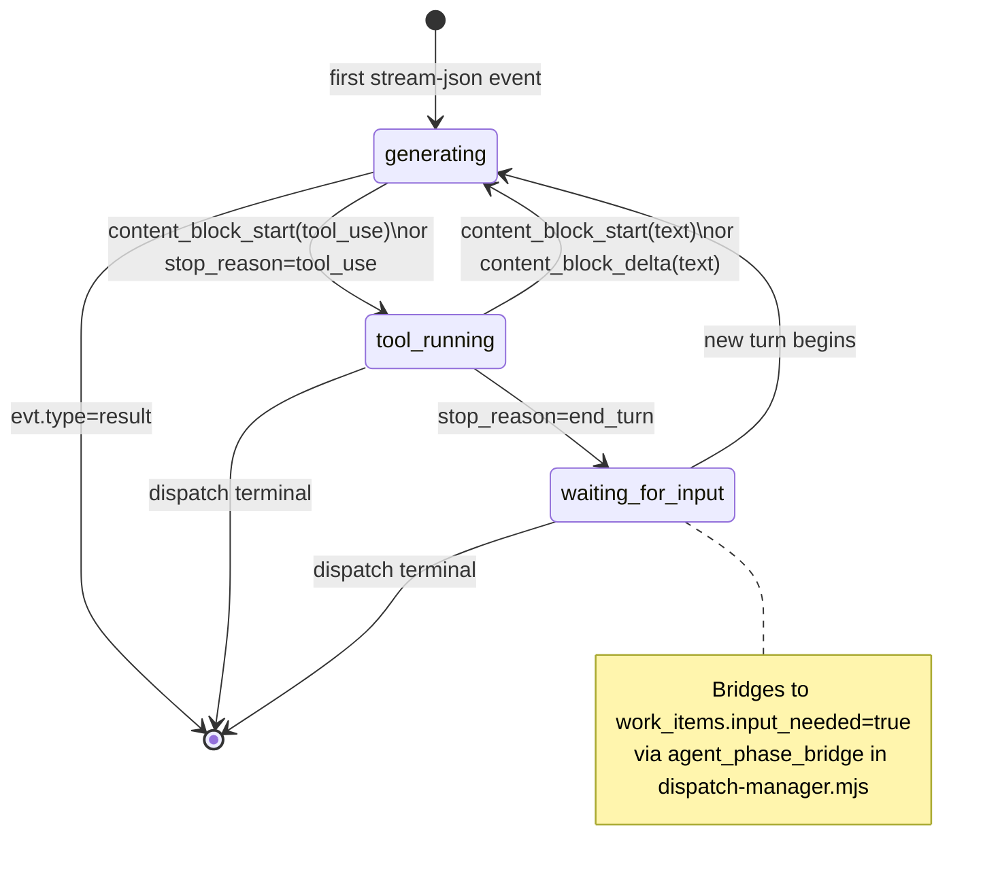

---

## 8. Portfolio Hierarchy

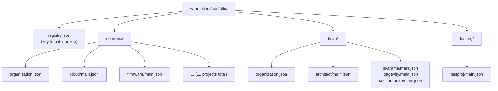

Portfolio files store full project profiles (stack, structure, guides, agent context). The `registry.json` maps project keys (`org/project/component`) to absolute file paths. Organization JSON holds shared conventions. Component JSON holds the full `ProjectBrief` and scout report.

---

## 9. Domain Entities Cross-check Summary

Confirmed drift between `entities.md` definitions and actual PostgreSQL migrations or source code. Scope limited to entities with both a domain schema and a DB representation.

| Entity | Aspect | entities.md (stale) | Actual source | Status |
|--------|--------|---------------------|---------------|--------|
| AgentPhase | description | "Ephemeral (in-memory only, not persisted to PostgreSQL)" | Persisted to `dispatches.agent_phase` + `agent_phase_history` since W-987 (migration 019) | Fixed in entities.md |
| AgentPhase | values | includes `worktree_setup` | `worktree_setup` is never emitted by `derivePhase()`; it is a PIPELINE_STAGES value (constants.mjs), set pre-spawn, not an agent phase | Fixed in entities.md |
| adrs | columns | project_key FK, number, status, author, source_work_item | org_key, type (TEXT), repos (JSONB), sync_run_id, detail_path — migration 017 | Corrected in ER diagram |
| adrs | id PK type | integer | TEXT — migration 017 | Corrected in ER diagram |
| repo_sync_configs | table name | repo_sync_configs (plural) | repo_sync_config (singular) — migration 015 | Corrected in ER diagram |
| work_items | approval column | approval (JSON) | No approval JSON column; approval tracked via work_item_approvals table and boolean approval_active field — migration 001 | Corrected in ER diagram |
| dispatches | columns | missing contract, timeout_at, agent_phase_history, contract_satisfied | All added by migrations 019–022 | Corrected in ER diagram |
| work_items | missing column | done_at absent | done_at TIMESTAMPTZ added by migration 023 | Corrected in ER diagram — flagged, not fixed in entities.md |

---

## 10. Two-Gate Lifecycle

Two-gate work item lifecycle: `open → [Plan Gate] → ready → in-progress → [Code Gate] → done`. The Plan Gate runs after the planner produces a plan; the Code Gate runs after tests pass, before commit. Both gates are read-only Review Board dispatches. Claude Code plan mode is an outer harness layer and does not substitute for either gate.

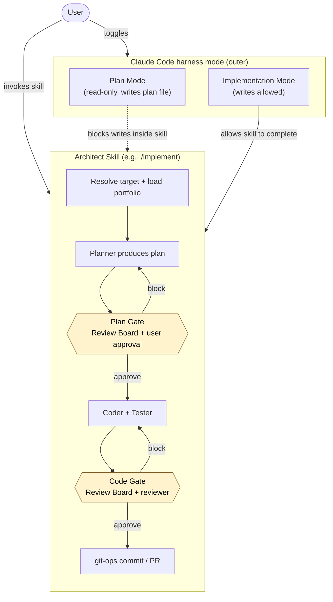

Source: `domain/rules.md` → Review Board Rules (Plan Gate / Code Gate triggers in `usecases/implement-work-item.md` steps 6 and 11).
