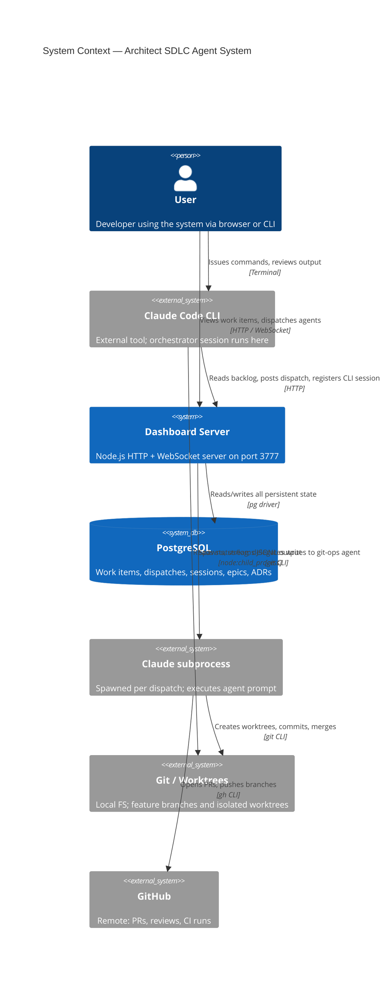
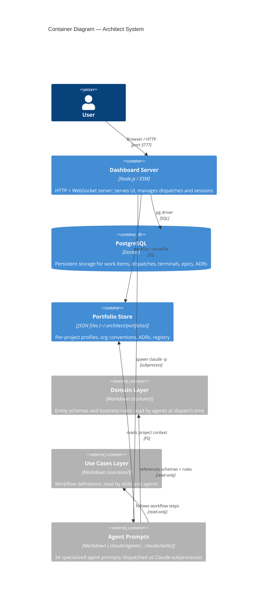
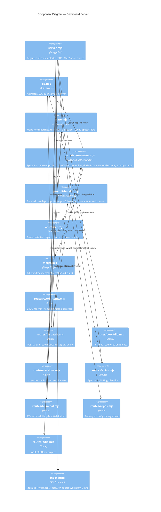
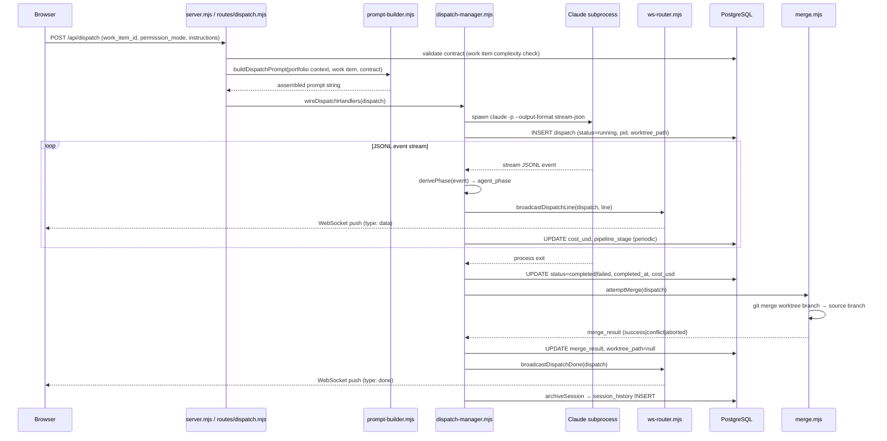
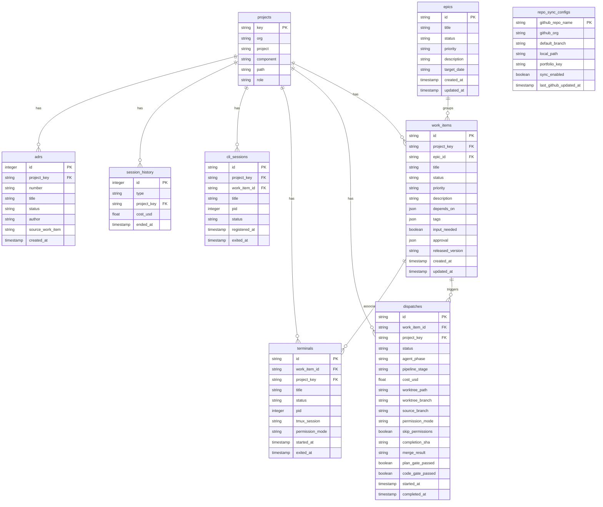

# Architecture Blueprint

Five Mermaid diagrams providing a visual reference for the architect system.

---

## 1. System Context

Top-level view of actors, systems, and their relationships.

---

## 2. Container Diagram

What runs where and how containers relate.

---

## 3. Component Diagram (Dashboard Container)

Internal structure of `tools/dashboard/`.

---

## 4. Data Flow — Dispatch Lifecycle

Sequence from POST /api/dispatch to session archive.

---

## 5. ER Diagram

Key PostgreSQL tables and their relationships.

