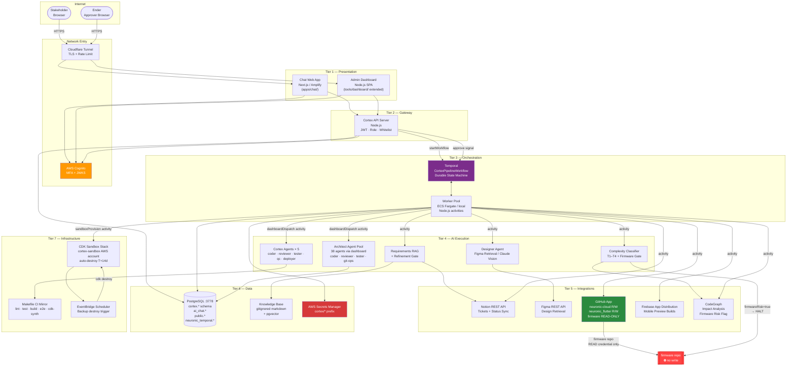

# Cortex: System Composition — Draft Reference

> **Status:** Draft — Board-reviewed 2026-05-25. Security block outstanding. Do not implement until critical items resolved.

## What Is Cortex

Cortex is an end-to-end autonomous AI software development pipeline for internal Neuronic use. It takes stakeholder requests from conversation → refinement → design → implementation → sandbox preview → human approval → production deployment. Scope is locked to `neuronic-cloud` (AWS CDK) and `neuronic_flutter`. Firmware is monitored but never modified (3-layer enforcement). Internet-accessible via Cloudflare Tunnel + Cognito MFA.

---

## AWS Credentials: Local Dev vs CI vs Cloud

| Context | Credential Source | Notes |
|---|---|---|
| **Local dev** (Temporal workers on Mac) | `~/.aws/credentials` (`dev` profile) — inherits from shell | Existing AWS CLI auth works. No change needed. |
| **CI / GitHub Actions** | OIDC-assumed `CortexCIRole` per account | New IAM role needed. Never use personal credentials in CI. |
| **Cloud workers** (ECS Fargate) | ECS Task Role attached to task definition | `secretsmanager:GetSecretValue` on `cortex/*`, `sts:AssumeRole` for sandbox CDK deploys. No credentials injected at runtime. |

---

## Component Composition

### Tier 1 — Presentation

**Chat Web App**
Next.js (App Router, standalone) chat interface with rich text + image upload. Users discuss, create, and refine requests here. Handles multi-turn refinement dialogue; triggers a Temporal workflow only when refinement maturity threshold is met. Served from ECS Fargate via Cloudflare Tunnel. Based on existing `apps/chat/` — the only change is swapping `ClaudeCliAdapter` for `TemporalOrchestratorAdapter` at the `OrchestratorPort` injection point.

**Admin Dashboard**
Operator control plane. Used by Ender to review active pipelines, approve human-gated releases, monitor sandbox TTLs, view audit logs, and inspect dispatch sessions. Extends the existing architect dashboard (`tools/dashboard/`) with Cortex-specific routes: pipeline stage view, sandbox lifecycle panel, request identity log, approval queue.

---

### Tier 2 — Gateway

**Cortex API Server**
Stateless HTTP/WebSocket bridge. Responsibilities: JWT verification against Cognito JWKS, user role resolution from PostgreSQL, routing chat messages to Temporal workflow starts, SSE streams for live agent output, enforcing the `ALLOWED_WRITE_REPOS` whitelist, forwarding approval signals as Temporal workflow signals, serving the notification stream. Node.js (mirrors `tools/dashboard/server.mjs` pattern).

**Auth Boundary (Cognito + Amplify)**
Delegates authentication to the existing Cognito user pool. API verifies JWTs; resolves user role from `cortex.users` (PostgreSQL is the source of truth for permissions). Google Workspace federation via Cognito IdP — neuronic.online Google accounts map to Cortex users on first login. MFA enforced at pool level for all Cortex users.

User hierarchy:
- `approver` (Ender): submit, run agents, approve releases, approve PRs, manage users
- `contributor` (Tekant + others): submit requests, run agents — cannot approve releases
- `viewer`: read-only pipeline status

---

### Tier 3 — Orchestration

**Temporal Workflow Engine**
Every Cortex job is a `CortexPipelineWorkflow` (durable state machine):

```
requirements_gathering → complexity_classification → [design_retrieval] →
[plan_gate] → agent_dispatch_chain → codegraph_check → sandbox_provision →
preview_gate → pr_creation+auto_review → release_gate → merge+real_repo_deploy →
sandbox_schedule_destroy → cleanup
```

Human gate signals: `approve-preview`, `approve-release`, `input-provided`. Temporal Cloud or self-hosted (W-1210 PostgreSQL setup is the self-hosted path — decision pending, see board findings).

**Worker Pool**
Node.js processes registering and executing all `CortexPipelineWorkflow` activities. Local dev: one worker process using `~/.aws dev` profile. Production: ECS Fargate tasks with Task Roles. All activities follow the pattern from `tools/temporal/activities/dispatch-agent.ts` (heartbeat, idempotency key, structured result type).

---

### Tier 4 — AI Execution

**Architect Agent Pool (38 agents, reused unchanged)**
All code generation, review, testing, and git operations run through the existing architect agent pool via `POST /api/dispatch` on the architect dashboard — wrapped by the Temporal `dashboardDispatch` activity. Agents receive per-job env vars: `CORTEX_JOB_ID`, `CORTEX_WORKFLOW_ID`, `NOTION_TICKET_URL`, `REQUEST_VERSION`, and a hard-coded `SCOPE_BOUNDARY` (`ALLOWED_TARGETS=neuronic_cloud,neuronic_flutter; DENIED_TARGETS=firmware_modification`).

**Cortex-Specific Agents (5 new)**
Located in `ai-team/agents/`: `coder` (neuronic CDK + Flutter conventions), `reviewer` (neuronic review standards), `tester` (runs Makefile CI mirror before any commit), `qc` (Playwright E2E against sandbox), `deployer` (CDK deploy + Firebase App Distribution).

**Designer Agent**
Retrieves Figma designs for existing components (Figma REST API) or generates design proposals using Claude Vision + Neuronic design system tokens. Returns `DesignSpec` (component tree, layout, color tokens, interaction states). Split into `FigmaRetrievalAdapter` (I/O) and `DesignGenerationAgent` (Claude Vision) for independent testability.

**Complexity Classifier + Estimator**
Fast Temporal activity (haiku model). Maps each request to T1–T4 and produces an effort estimate. Critical gate: if `requiresFirmwareAccess = true`, the pipeline halts before any agent is dispatched. Complexity → dispatch pattern: T1 = direct coder, T2 = sequential pipeline, T3 = parallel fan-out, T4 = plan-then-execute with board gate.

**Requirements RAG Agent**
Enriches requests with Neuronic context from the in-repo knowledge base + Notion. Returns `IntakePackage` with a `clarifications_needed` list. If non-empty, pipeline waits via Temporal `condition()` until the user provides input — enforcing "get full input first, then escalate." Refinement maturity tracked in `cortex.refinement_state`; pipeline only starts when the threshold is met.

---

### Tier 5 — Integrations

**Notion (REST API, not MCP)**
Every job creates a Notion page in the Neuronic database. Properties carry the full `RequestIdentity` (user name, email, ID, ticket reference, complexity tier, target side, version tag). Status updates flow from Temporal signals back to Notion. `NotionAdapter` class, direct REST calls with retry on 429. API key in Secrets Manager.

**Figma (REST API)**
Retrieves design files and component nodes. Converts Figma JSON to `DesignSpec`. Figma token in Secrets Manager.

**GitHub App**
Manages all cross-repo Git operations. Permissions: `neuronic-cloud` and `neuronic_flutter` = read+write; `firmware` = read-only (credential-level enforcement, not just software). Handles: branch creation (`CORTEX-<jobId>`), PR creation, CI status polling, auto-review dispatch before merge, final merge on release gate approval.

**Firebase App Distribution**
Post-sandbox Flutter build uploaded to Firebase App Distribution. Download link included in Notion ticket and dashboard preview panel. Firebase service account JSON in Secrets Manager.

**CodeGraph**
Pre-dispatch impact analysis via `codegraph_impact`. Returns `affectedComponents` and `firmwareRisk` boolean. `firmwareRisk = true` → hard non-retryable halt. Also used by branch_registry for parallel-job conflict detection.

---

### Tier 6 — Data

**PostgreSQL (multi-schema, port 3778)**
Existing instance extended with `cortex` schema. Key tables:

| Table | Purpose |
|---|---|
| `cortex.jobs` | Canonical job record: `workflow_id`, `notion_ticket_id`, `user_sub`, `status`, `complexity_tier`, `version_tag` |
| `cortex.job_tracking` | Per-operation audit: actor email, name, Cognito sub, ticket reference, target side, version number |
| `cortex.sandboxes` | Sandbox lifecycle: `cdk_stack_name`, `aws_account`, `created_at`, `destroy_at` (14-day TTL) |
| `cortex.refinement_state` | Conversation maturity: `maturity_score`, `push_back_count`, `last_clarification_at` |
| `cortex.branch_registry` | Parallel-job conflict detection: `job_id`, `project_key`, `branch_name`, `pr_url`, `merge_status` |
| `cortex.notifications` | User-targeted dashboard notifications with JSONB `payload` |
| `cortex.users` | User hierarchy: `cognito_sub`, `email`, `role`, `google_workspace_id`, `notion_user_id` |

Existing schemas unchanged: `ai_chat.*`, `public.*`, `neuronic_temporal.*`, `neuronic_temporal_visibility.*`.

**Neuronic Knowledge Base (in-repo, gitignored)**
Structured domain knowledge for RAG. Located at `knowledge/neuronic/` in the ai-team repo (gitignored). Markdown with YAML frontmatter. Embeddings in PostgreSQL via `pgvector`. Content: ADRs, API contracts, data model docs, known constraints, cross-project dependency maps, historical patterns.

**Secrets (AWS Secrets Manager, `cortex/*` prefix)**
Anthropic API key, Figma token, Notion API key, GitHub App private key, Firebase service account, Cognito App Client secret, PostgreSQL passwords. Local dev mirrors with `~/.ssh/claude-keys/cortex-dev/` (600 permissions). No secrets in `.env` files or any repository.

---

### Tier 7 — Infrastructure

**Cloud Sandbox (CDK, auto-destroy 14d)**
Ephemeral CDK stack (`CortexSandbox-<jobId>`) in a dedicated `cortex-sandbox` AWS account (isolated from dev/stage/prod — no cross-account trust). Two independent destroy mechanisms: (1) Temporal timer activity sends `destroy-sandbox` signal, (2) EventBridge Scheduler backs this up with a Lambda that calls `cdk destroy` independently. EventBridge trigger is created at provisioning time, not inside the Temporal workflow.

**Makefile CI Mirror**
`Makefile` in the ai-team repo mirroring neuronic GitHub Actions workflow steps. Targets: `lint`, `test`, `build`, `e2e`, `cdk-synth`, `all`. The `tester` agent runs `make all` inside its worktree before committing. Should run inside the same Docker base image as CI to prevent drift.

**Cloudflare Tunnel**
Internet accessibility via `cloudflared` outbound daemon. No inbound router port forwarding. Cloudflare terminates TLS, applies rate limiting (10 req/s per IP, 100 auth attempts/hour). Custom subdomain (`cortex.neuronic.online` or equivalent).

---

## Architecture Diagram



---

## Firmware Boundary: 3-Layer Enforcement

| Layer | Mechanism | Scope |
|---|---|---|
| Credential | GitHub App: `firmware` = read-only permission | API-level, cannot be bypassed by prompts |
| API | `ALLOWED_WRITE_REPOS` whitelist in Cortex API Server | Software-level, returns 403 on violations |
| Agent | `SCOPE_BOUNDARY` in every dispatch contract | Agent self-terminates on out-of-scope request |

`firmwareRisk = true` from CodeGraph → non-retryable pipeline halt. Not a pause, not a gate — a full stop.

---

## Review Board Verdicts (2026-05-25)

Seven perspectives evaluated. Aggregate result: **BLOCK** (Security perspective).

| Perspective | Verdict |
|---|---|
| SWE | revise |
| Architecture | revise |
| PM | revise |
| **Security** | **block** |
| DX | revise |
| Systems | revise |
| DBA | revise |

### Pre-Launch Blockers (Must Resolve Before Internet Exposure)

1. **Agent subprocess OS user isolation** — agent subprocesses must run under a dedicated low-privilege OS user with no access to `~/.ssh/` or `~/.aws/`. Non-negotiable before internet launch.

2. **Prompt injection threat model** — define sanitization layer at refinement stage; restrict agent tool access per stage; add agent output review before any `git push`.

3. **dashboardDispatch resilience contract** — define `ApplicationFailure(nonRetryable=true)` for infrastructure-down vs. retriable for agent failure; add health-check before each dispatch.

4. **condition() timeouts** — all `condition()` waiting for human input must be paired with a 72h timer → `stalled` status + notification on timeout.

5. **Temporal Cloud vs. self-hosted decision** — W-1210 PostgreSQL setup is the self-hosted fallback. Temporal Cloud externalizes workflow history (contains agent prompts + code). Decide before sensitive neuronic code flows through.

### High-Priority (First Sprint)

6. **Temporal Mutex workflow (required, not optional)** — `cortex.branch_registry` concurrent-write race condition requires a Mutex child workflow. All branch-touching activities must acquire it.

7. **Sandbox account fallback** — define fallback path (isolated VPC in existing non-prod account) so preview gate is unblocked while AWS account vending proceeds.

8. **PostgreSQL schema-level RBAC** — one role per schema group: `cortex_app`, `temporal_worker`, `chat_app`. Scoped `GRANT` in migrations.

9. **PR auto-review board bridge** — triggers `tech-reviewer-*` dispatch on PR creation; blocks merge signal until all-approve verdict. Must be in place before first contributor-facing release.

10. **Local dev story** — `docker-compose` with `temporal server start-dev` + local OrchestratorPort target. Document before any contributor onboards.

11. **MFA AMR claim validation** — API authorizer must verify `amr` claim includes `mfa`; not just JWT signature validity.

12. **EventBridge trigger at provisioning time** — must be created in `sandboxProvision` activity, not inside the Temporal workflow, so it fires independently of Temporal availability.

---

## Implementation Sequence

Dependencies determine sequence. Chat Web App OrchestratorPort swap can run in parallel with Tier 3.

```
1. Infrastructure (Cloudflare, sandbox account fallback, Makefile, Secrets Manager structure)
2. Gateway (API Server, Cognito middleware, cortex.users schema)
3. Data (cortex schema migrations, pgvector setup)
4. Orchestration (Temporal workflow, worker pool, Mutex workflow)
   └── parallel: Chat Web App OrchestratorPort swap
5. AI Execution (Cortex agents, classifier, RAG agent, designer agent)
6. Integrations (Notion, Figma, GitHub App, Firebase, CodeGraph activity)
7. Presentation (admin dashboard extensions)
```

---

## Key Files (Existing, Referenced by This Design)

| File | Role in Cortex |
|---|---|
| `projects/neuronic/ai-team/apps/chat/ports/OrchestratorPort.ts` | Injection point for `TemporalOrchestratorAdapter` |
| `tools/temporal/workflows/sdlc-pipeline.ts` | Seed for `CortexPipelineWorkflow` |
| `tools/temporal/activities/dispatch-agent.ts` | Pattern for all new Cortex activities |
| `tools/dashboard/migrations/032-ai-chat-schema.mjs` | `ai_chat` schema pattern for `cortex` schema migration |
| `projects/neuronic/ai-team/apps/chat/middleware.ts` | Cognito PKCE auth flow (extend for role upgrade) |
| `docs/guides/temporal-architect-integration.md` | Temporal coordination layer spec |
| `docs/guides/temporal-postgresql-setup.md` | Schema setup and idempotency model |
