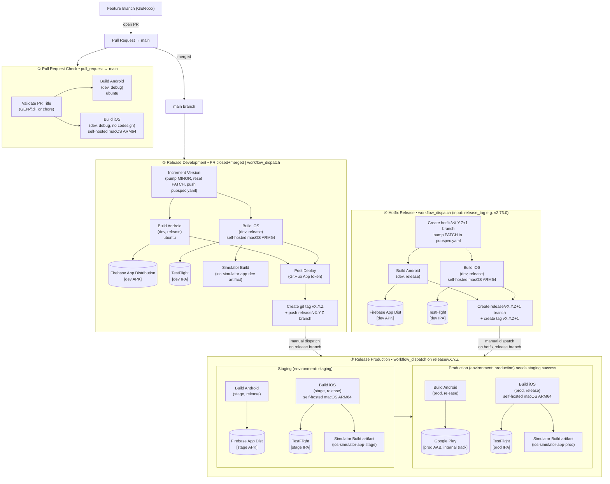
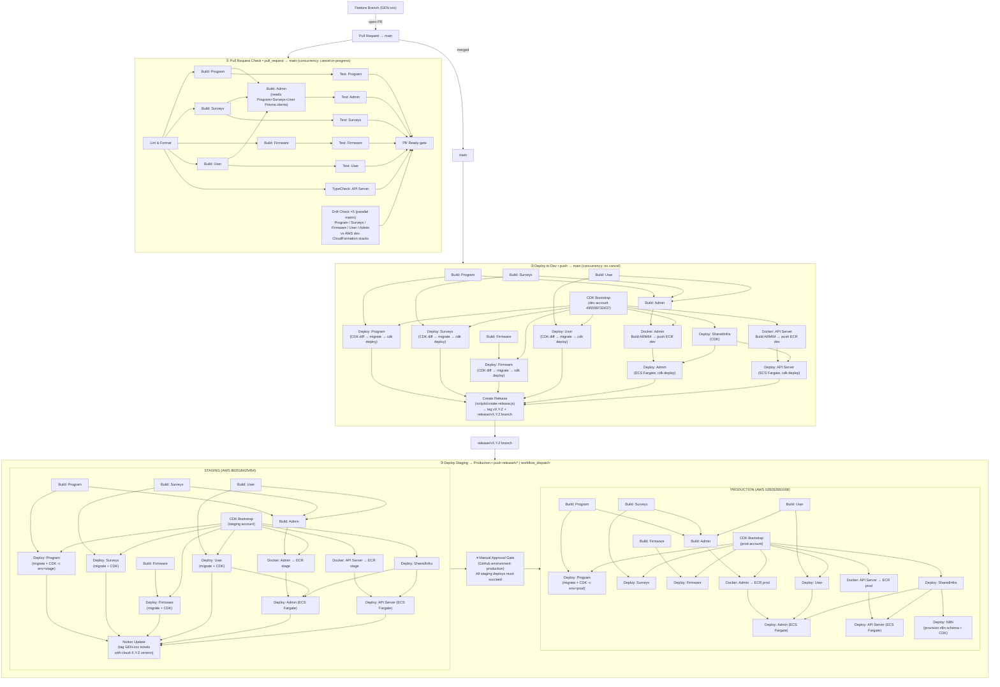

# Neuronic CI/CD Pipelines

Mermaid diagrams for the GitHub Actions CI/CD pipelines in the Neuronic Flutter and Neuronic Cloud projects.

---

## Neuronic Flutter

Four workflows in `.github/workflows/`:

| Workflow | Trigger |
|----------|---------|
| `pull-request-check.yaml` | PR opened/updated against `main` |
| `release-development.yaml` | PR merged to `main` or `workflow_dispatch` |
| `flutter-deploy-stage-and-production.yaml` | `workflow_dispatch` on a `release/v*` branch |
| `hotfix-release.yaml` | `workflow_dispatch` (input: release tag to hotfix) |

---

## Neuronic Cloud

Three workflows in `.github/workflows/`:

| Workflow | Trigger |
|----------|---------|
| `pr-check.yaml` | PR opened/updated against `main` |
| `deploy-dev.yaml` | Push to `main` |
| `deploy-staging-production.yaml` | Push to `release/v*` or `workflow_dispatch` |

